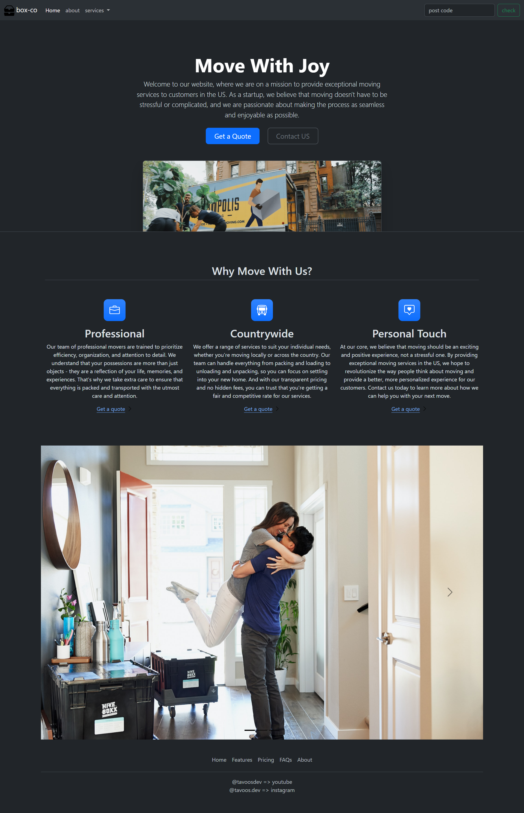

# 📦 Box-Co.

A responsive moving and package delivery service landing page built with **HTML5, CSS3, and Bootstrap 5**.

🔗 **Live Demo:** https://alitavousi83.github.io/box-co/

---

## 📸 Preview

**Box-Co.** is a modern landing page for a fictional moving and package delivery service in the United States.

The project focuses on creating a clean, responsive, and user-friendly interface using **HTML, CSS, and Bootstrap**.

## 📸 Screenshots

.png)

---

## ✨ Features

* 📱 Fully responsive design
* 🧭 Responsive navigation bar
* 🏠 Hero section with clear call-to-action buttons
* 📦 Moving and package delivery services
* ⭐ "Why Move With Us?" section
* 📍 Postcode checking section
* 💬 Quote and contact sections
* 🎨 Clean and modern UI
* ⚡ Bootstrap-based components and utilities
* 📐 Responsive grid layout

---

## 🛠️ Technologies Used

* **HTML5**
* **CSS3**
* **Bootstrap 5**

---

## 🧩 Bootstrap

This project was built using **Bootstrap's ready-made components and utility classes**.

The Bootstrap components were customized and combined to create the final page design.

Some of the Bootstrap features used in this project include:

* Navbar
* Buttons
* Cards
* Grid system
* Containers
* Typography utilities
* Spacing utilities
* Responsive utilities

---

## 📱 Responsive Design

The website is designed to provide a consistent experience across different screen sizes:

* 💻 Desktop
* 💻 Laptop
* 📱 Tablet
* 📱 Mobile

Bootstrap's responsive grid system and utility classes were used to adapt the layout to different devices.

---

## 🖥️ Website Sections

### Navigation

The navigation bar provides access to the main sections of the website:

* Home
* About
* Services
* Postcode
* Check

### Hero

The hero section introduces the moving service and provides the main calls to action:

* **Get a Quote**
* **Contact Us**

### Why Move With Us?

The feature section highlights three main benefits of the service:

**Professional**
A professional moving team focused on efficiency, organization, and taking care of customers' belongings.

**Countrywide**
Moving services designed for both local and long-distance moves, from packing and loading to unloading and unpacking.

**Personal Touch**
A more personalized approach intended to make the moving experience simpler and less stressful.

---

## 🧠 What I Learned

Building this project helped me practice:

* Creating responsive layouts with Bootstrap
* Working with Bootstrap's grid system
* Using and customizing pre-built Bootstrap components
* Structuring a complete landing page
* Creating responsive navigation
* Building reusable UI sections
* Working with responsive utilities
* Combining HTML, CSS, and Bootstrap into a complete front-end project

